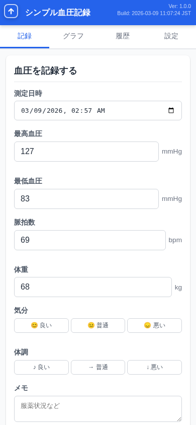
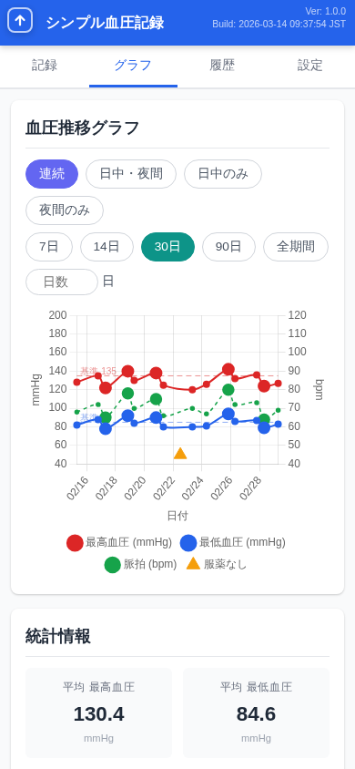
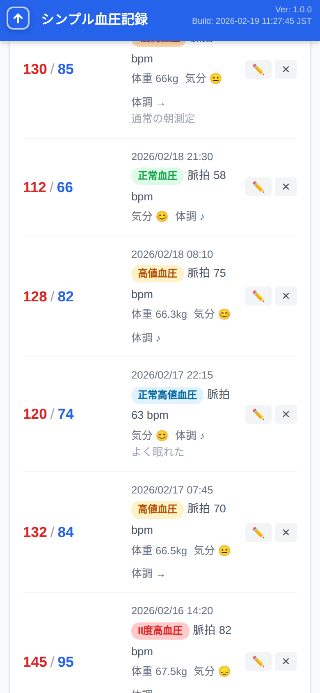
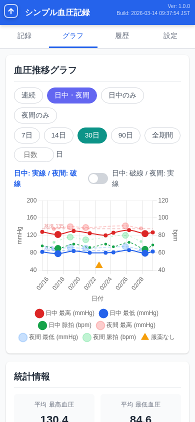
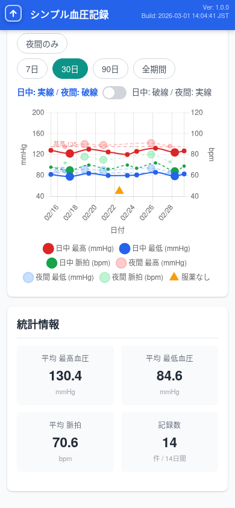
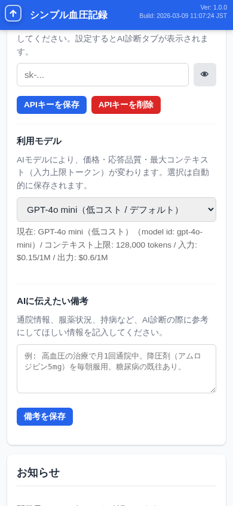
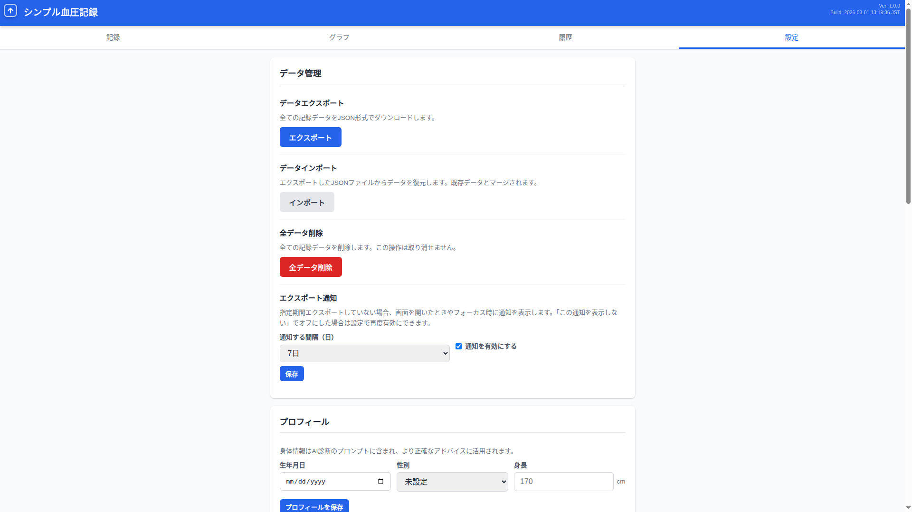
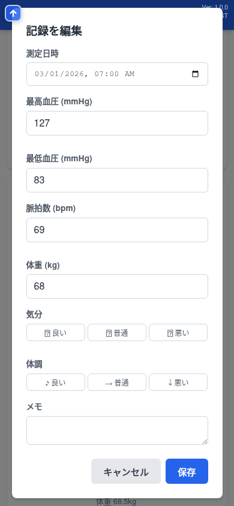

<h1 align="center">
  <br>
  💓 シンプル血圧記録
  <br>
</h1>

<h3 align="center">毎日の血圧管理を、もっとシンプルに。</h3>

<p align="center">
  アカウント登録不要・完全無料・データはあなたの端末だけに保存。<br>
  スマートフォンでもPCでも、すぐに使い始められる血圧記録Webアプリです。
</p>

<p align="center">
  <a href="https://sbpr-three.vercel.app/"><strong>▶ 今すぐ使ってみる</strong></a>
</p>

<p align="center">
  
  &nbsp;&nbsp;
  
  &nbsp;&nbsp;
  
</p>

---

## なぜ「シンプル血圧記録」？

血圧管理アプリは数多くありますが、多くはアカウント登録を求めたり、広告が表示されたり、データがクラウドに送信されたりします。

**シンプル血圧記録**は、そのすべてを排除しました。

- **アカウント登録なし** — URLを開くだけで即利用開始
- **広告なし** — 集中を妨げる要素はゼロ
- **データ送信なし** — 血圧データは端末内（IndexedDB）に保存。サーバーには一切送信しません
- **完全無料** — すべての機能を制限なく利用可能

---

## 主な機能

### 📝 かんたん記録

血圧値を入力して保存するだけ。前回の値が自動でプリフィルされるので、変化のある項目だけ修正すればOKです。

- 最高血圧・最低血圧（必須）
- 脈拍・体重・気分・体調・メモ（任意）
- 測定日時の変更も可能

<p align="center">
  
</p>

> JSH2019 家庭血圧基準に基づき、記録ごとに血圧分類（正常血圧〜III度高血圧）が自動表示されます。

---

### 📊 見やすいグラフ

血圧の推移を折れ線グラフで一目確認。7日・30日・90日・全期間の切り替えが可能です。

<p align="center">
  
  &nbsp;&nbsp;&nbsp;
  
</p>

**2つの表示モード:**

| モード | 特徴 |
|--------|------|
| **連続** | 全データを1本の線で時系列表示（従来型） |
| **日中・夜間** | 日中と夜間のデータを色分け表示。時間帯区切りはカスタマイズ可能 |

家庭血圧の基準線（135/85 mmHg）が常にグラフ上に表示されるので、自分の血圧がどの位置にあるか直感的に把握できます。

---

### 📈 統計情報

選択期間の平均値と記録数が自動計算されます。

<p align="center">
  
</p>

---

### 🤖 AI健康アドバイス

OpenAI APIキーを設定すると、あなたの血圧データに基づいたAI健康アドバイスを受けられます。

- 血圧の傾向分析
- 食事・運動・生活習慣に関する実践的なアドバイス
- チャット形式で追加の質問も可能

<p align="center">
  
</p>

> ※ AI診断は医療行為ではありません。参考情報としてご利用ください。

---

### 📱 スマートフォン最適化 & PWA対応

スマートフォンのホーム画面に追加すれば、ネイティブアプリのように利用できます。

- **完全オフライン動作** — インターネット接続なしでも記録・閲覧可能
- **ホーム画面アイコン** — ワンタップで起動
- **バッジ通知** — 当日の記録がまだない場合、アイコンにバッジを表示（Chrome/Edge）
- **自動更新** — 新バージョンが利用可能になると自動通知

---

### 💾 データのバックアップ

JSON形式でエクスポート/インポートに対応。端末の買い替え時もデータを簡単に移行できます。

<p align="center">
  
</p>

---

### ✏️ 記録の編集・管理

過去の記録はいつでも編集・削除可能。履歴タブでは日付フィルタで期間を絞り込めます。

<p align="center">
  
</p>

---

## 使い方

### ステップ 1: アクセス

ブラウザで以下のURLにアクセスするだけ。アカウント登録は不要です。

👉 **https://sbpr-three.vercel.app/**

### ステップ 2: 記録する

血圧値を入力して「記録を保存」をタップ。

### ステップ 3: 確認する

グラフタブで推移を確認。統計情報で平均値をチェック。

### (オプション) ホーム画面に追加

- **iPhone**: Safari → 共有ボタン → 「ホーム画面に追加」
- **Android**: Chrome → メニュー → 「ホーム画面に追加」

---

## プライバシーへのこだわり

| 項目 | 内容 |
|------|------|
| データ保存先 | 端末内のブラウザ（IndexedDB） |
| サーバー送信 | 一切なし（AI診断利用時のみOpenAI APIへ送信） |
| アカウント | 不要 |
| トラッキング | なし |
| 広告 | なし |

あなたの健康データは、あなたの端末だけにあります。

---

## 対応環境

| 環境 | 対応状況 |
|------|----------|
| Chrome (Android/PC) | ✅ 全機能対応 |
| Safari (iPhone/iPad) | ✅ 全機能対応 |
| Edge (PC) | ✅ 全機能対応 |
| Firefox | ✅ 対応（一部PWA機能を除く） |

---

## 技術情報

開発者向けの技術情報です。

| 項目 | 技術 |
|------|------|
| フロントエンド | HTML + vanilla JavaScript（SPA、フレームワーク不使用） |
| スタイル | CSS（ビルドツール不使用） |
| データストア | IndexedDB |
| グラフ描画 | [Chart.js](https://www.chartjs.org/) v4 |
| PWA | Web App Manifest + Service Worker |
| テスト | Jest + Puppeteer |
| コンテナ | Docker（nginx:alpine / node:alpine） |
| デプロイ | Vercel |

### ローカル開発

```bash
# Docker でビルド＆起動
./scripts/build.sh

# ブラウザで http://localhost:8082 にアクセス
```

### テスト実行

```bash
docker compose run --rm sbpr-test npm test
```

---

## ドキュメント

- [ユーザーマニュアル](docs/manual.md) — 全機能の操作ガイド（スクリーンショット付き）
- [要件定義書](docs/requirements_definition.md)
- [基本設計書](docs/basic_design.md)
- [詳細設計書](docs/detailed_design.md)
- [テスト仕様書](docs/test_specification.md)

---

<p align="center">
  <br>
  <a href="https://sbpr-three.vercel.app/"><strong>💓 シンプル血圧記録を使ってみる →</strong></a>
  <br><br>
  毎日の血圧管理を、もっとシンプルに。
</p>
