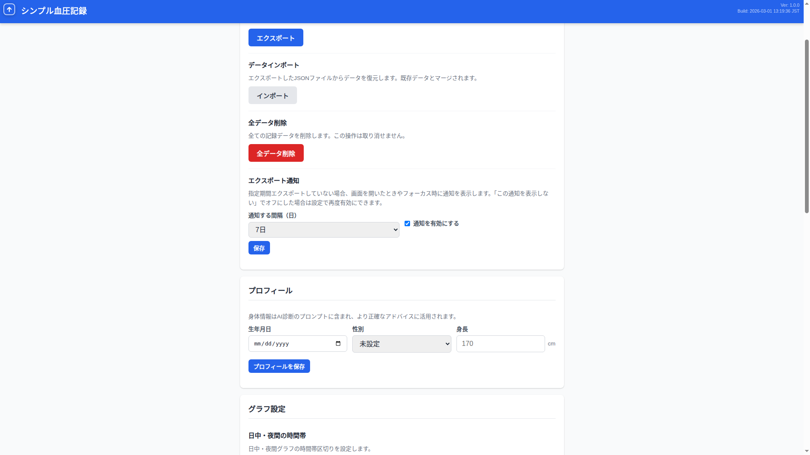
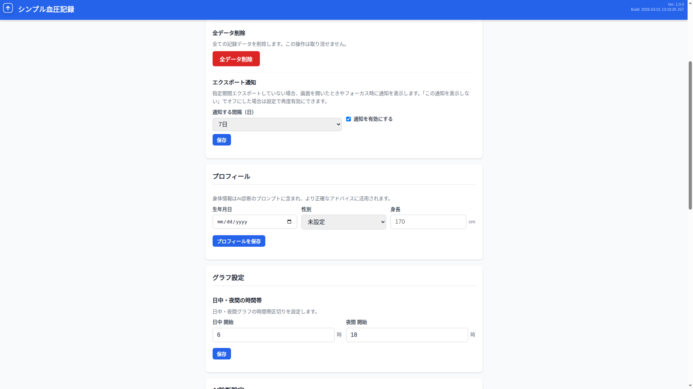

# シンプル血圧記録 (sbpr) ユーザーマニュアル

## 目次

1. [はじめに](#1-はじめに)
2. [記録タブ - 血圧を記録する](#2-記録タブ---血圧を記録する)
3. [記録タブ - 直近の記録](#3-記録タブ---直近の記録)
4. [記録の編集](#4-記録の編集)
5. [グラフタブ - 連続モード](#5-グラフタブ---連続モード)
6. [グラフタブ - 日中・夜間モード](#6-グラフタブ---日中夜間モード)
7. [グラフタブ - 統計情報](#7-グラフタブ---統計情報)
8. [履歴タブ](#8-履歴タブ)
9. [設定タブ - データ管理](#9-設定タブ---データ管理)
10. [設定タブ - プロフィール](#10-設定タブ---プロフィール)
11. [設定タブ - グラフ設定](#11-設定タブ---グラフ設定)
12. [設定タブ - AI診断設定](#12-設定タブ---ai診断設定)
13. [設定タブ - アプリ情報](#13-設定タブ---アプリ情報)
14. [AI診断タブ](#14-ai診断タブ)
15. [PWA対応（ホーム画面に追加）](#15-pwa対応ホーム画面に追加)

---

## 1. はじめに

「シンプル血圧記録（sbpr）」は、日々の血圧測定データをブラウザ上で記録・管理できるWebアプリです。

**主な機能:**

- 血圧（最高・最低）、脈拍、体重、気分、体調、メモの記録
- グラフによる推移表示（連続 / 日中・夜間モード）
- 統計情報の自動計算
- 記録履歴の一覧・日付フィルタ
- データのエクスポート/インポート（JSON形式）
- AI健康アドバイス（OpenAI API連携）
- PWA対応（ホーム画面に追加してオフライン利用可能）

**データの保存先:** ブラウザの IndexedDB にローカル保存されます。サーバーへの送信はありません。

---

## 2. 記録タブ - 血圧を記録する

アプリを開くと最初に表示されるのが記録タブです。

### 入力項目

| 項目 | 必須 | 説明 |
|------|------|------|
| 測定日時 | - | 自動で現在日時がセットされます。変更も可能です |
| 最高血圧 | 必須 | 収縮期血圧（mmHg）。50〜300の範囲 |
| 最低血圧 | 必須 | 拡張期血圧（mmHg）。30〜200の範囲 |
| 脈拍数 | 任意 | 心拍数（bpm）。30〜250の範囲 |
| 体重 | 任意 | 体重（kg）。0.1kg単位で入力可能 |
| 気分 | 任意 | 良い / 普通 / 悪い の3段階。タップで選択・もう一度タップで解除 |
| 体調 | 任意 | 良い / 普通 / 悪い の3段階 |
| メモ | 任意 | 服薬状況などを自由記入 |

### 操作方法

1. 各項目を入力します
2. 「記録を保存」ボタンをタップします
3. 保存成功のメッセージが表示されます
4. フォームには直前の記録の値がプリフィルされるため、変化のある値だけ修正して素早く記録できます

> **ヒント:** 入力欄をタップすると値が全選択されるので、そのまま新しい値を入力すれば上書きできます。

---

## 3. 記録タブ - 直近の記録

記録フォームの下に、直近10件の記録が一覧表示されます。

各記録には以下の情報が表示されます:

- **血圧値**（赤: 最高 / 青: 最低）
- **測定日時**
- **血圧分類**（色付きバッジ）
  - 正常血圧（緑）
  - 正常高値血圧（水色）
  - 高値血圧（黄色）
  - I度高血圧（オレンジ）
  - II度高血圧（赤）
  - III度高血圧（濃い赤）
- **脈拍**、**体重**、**気分**、**体調**、**メモ**（入力がある場合）
- **編集ボタン**（鉛筆アイコン）/ **削除ボタン**（×アイコン）

---

## 4. 記録の編集

記録の鉛筆アイコンをタップすると編集ダイアログが開きます。

### 操作方法

1. 直近の記録一覧、または履歴タブで鉛筆アイコンをタップ
2. 編集ダイアログが表示され、現在の値が入力欄にセットされます
3. 値を修正します
4. 「保存」をタップして更新、または「キャンセル」で取り消し

### 記録の削除

記録の×ボタンをタップすると確認ダイアログが表示されます。「削除」をタップすると記録が削除されます。

---

## 5. グラフタブ - 連続モード

画面上部の「グラフ」タブをタップするとグラフが表示されます。初期状態では「連続」モードが選択されています。

### グラフの見方

- **赤色の実線**: 最高血圧（mmHg）- 左軸
- **青色の実線**: 最低血圧（mmHg）- 左軸
- **緑色の点線**: 脈拍（bpm）- 右軸
- **赤色の横破線**: 基準線 135 mmHg（家庭血圧の高血圧基準）
- **青色の横破線**: 基準線 85 mmHg（家庭血圧の高血圧基準）

### 期間の切り替え

期間ボタンで表示範囲を変更できます:

| ボタン | 表示範囲 |
|--------|----------|
| 7日 | 直近7日間（デフォルト） |
| 30日 | 直近30日間 |
| 90日 | 直近90日間 |
| 全期間 | 全ての記録 |

---

## 6. グラフタブ - 日中・夜間モード

「日中・夜間」ボタンをタップすると、日中と夜間のデータが色分けされて表示されます。

### 線の色と種類

| データ | 色 | 線の種類 |
|--------|------|---------|
| 日中 最高血圧 | 赤（濃） | 実線 |
| 日中 最低血圧 | 青（濃） | 実線 |
| 日中 脈拍 | 緑（濃） | 点線 |
| 夜間 最高血圧 | 赤（薄） | 破線 |
| 夜間 最低血圧 | 青（薄） | 破線 |
| 夜間 脈拍 | 緑（薄） | 破線点線 |

### 使い方

1. グラフタブ上部の「日中・夜間」ボタンをタップ
2. 日中データ（実線）と夜間データ（破線）が色分けされて表示されます
3. 「連続」ボタンをタップすると元の表示に戻ります
4. 期間切り替え（7日/30日/90日/全期間）はモードに関係なく使えます

> **ヒント:** 日中・夜間の時間帯は設定タブの「グラフ設定」から変更できます（[11. グラフ設定](#11-設定タブ---グラフ設定)を参照）。

---

## 7. グラフタブ - 統計情報

グラフの下に、選択した期間の統計情報が表示されます。

### 表示項目

| 項目 | 説明 |
|------|------|
| 平均 最高血圧 | 表示期間内の最高血圧の平均値 |
| 平均 最低血圧 | 表示期間内の最低血圧の平均値 |
| 平均 脈拍 | 表示期間内の脈拍の平均値 |
| 記録数 | 表示期間内の記録件数 |

統計情報は期間ボタンの切り替えに連動して自動更新されます。

---

## 8. 履歴タブ

「履歴」タブをタップすると、全ての記録が新しい順に一覧表示されます。

### 日付フィルタ

画面上部の日付入力欄で期間を絞り込めます:

1. 開始日・終了日を入力すると、その期間の記録のみ表示されます
2. 「クリア」ボタンで絞り込みを解除します

### 各記録の操作

記録タブと同様に、各記録の鉛筆アイコンで編集、×ボタンで削除ができます。

---

## 9. 設定タブ - データ管理

「設定」タブの最上部にデータ管理機能があります。

### データエクスポート

「エクスポート」ボタンをタップすると、全ての記録データがJSON形式でダウンロードされます。

エクスポートファイルには以下が含まれます:
- 全ての血圧記録データ
- プロフィール情報
- AI備考
- AIモデル設定
- グラフ設定（日中・夜間の時間帯）

> **バックアップとして定期的にエクスポートすることを推奨します。**

### データインポート

「インポート」ボタンをタップしてJSONファイルを選択すると、データが復元されます。

- 既存データとマージ（統合）されます
- 同じIDの記録は重複せずスキップされます
- プロフィール、AI設定、グラフ設定も復元されます

### 全データ削除

「全データ削除」ボタンをタップすると、確認ダイアログが表示されます。実行すると全ての記録データが削除されます。**この操作は取り消せません。**

---

## 10. 設定タブ - プロフィール

身体情報を設定できます。設定した情報はAI診断のプロンプトに含まれ、より正確なアドバイスに活用されます。

### 設定項目

| 項目 | 説明 |
|------|------|
| 生年月日 | 年齢の自動計算に使用 |
| 性別 | 男性 / 女性 / その他 |
| 身長 | cm単位。BMI計算等に利用 |

入力後「プロフィールを保存」ボタンをタップして保存します。

---

## 11. 設定タブ - グラフ設定

日中・夜間グラフの時間帯区切りを設定します。

### デフォルト値

| 項目 | デフォルト | 説明 |
|------|-----------|------|
| 日中 開始 | 6時 | この時刻以降の測定を「日中」として扱います |
| 夜間 開始 | 18時 | この時刻以降の測定を「夜間」として扱います |

デフォルト設定の場合: 6:00〜17:59 → 日中、18:00〜翌5:59 → 夜間

### 設定の変更方法

1. 「日中 開始」に0〜23の整数を入力
2. 「夜間 開始」に0〜23の整数を入力
3. 「保存」ボタンをタップ
4. 日中・夜間モードのグラフに即座に反映されます

---

## 12. 設定タブ - AI診断設定

AI健康アドバイス機能の設定を行います。

### OpenAI APIキー

AI診断機能を利用するにはOpenAI APIキーが必要です。

1. APIキー入力欄に `sk-...` 形式のキーを入力
2. 「APIキーを保存」をタップ
3. 画面上部のタブに「AI診断」タブが表示されます

> 目のアイコンをタップするとAPIキーの表示/非表示を切り替えられます。

### 利用モデル

AIモデルを選択できます。モデルにより価格・応答品質・最大コンテキストが異なります。選択は自動的に保存されます。

### AIに伝えたい備考

通院情報、服薬状況、持病など、AI診断の際に参考にしてほしい情報を記入します。「備考を保存」をタップで保存されます。

---

## 13. 設定タブ - アプリ情報

アプリのバージョン情報と更新確認機能があります。

### 表示項目

- アプリ名
- バージョン
- ビルド日時
- データ保存先

### アプリの更新

「更新を確認」ボタンをタップすると、新しいバージョンが利用可能か確認します。更新がある場合は画面上部に更新バナーが表示され、「今すぐ更新」をタップするとアプリが最新版に更新されます。

---

## 14. AI診断タブ

OpenAI APIキーを設定するとタブに「AI診断」が表示されます。血圧データに基づいたAI健康アドバイスを受けられます。

### 使い方

1. 「診断を開始」ボタンをタップ
2. AIが血圧データを分析し、健康アドバイスを返します
3. 追加の質問を入力欄から送信できます
4. AIからの回答末尾に提案質問が表示されるので、タップして続けることもできます
5. 「会話をクリア」で会話をリセットできます

> **注意:** AI診断は医療行為ではありません。参考情報としてご利用ください。体調に不安がある場合は必ず医療機関を受診してください。

### 会話の保存

- AI会話はブラウザに自動保存されます
- アプリを閉じて再度開いても、前回の会話が復元されます
- 新しい血圧データが追加されると、次の質問時に自動的にAIに通知されます

---

## 15. PWA対応（ホーム画面に追加）

本アプリはPWA（Progressive Web App）に対応しており、スマートフォンのホーム画面に追加してネイティブアプリのように利用できます。

### ホーム画面への追加方法

**iPhone (Safari):**
1. アプリをSafariで開く
2. 共有ボタン（四角に上矢印のアイコン）をタップ
3. 「ホーム画面に追加」を選択

**Android (Chrome):**
1. アプリをChromeで開く
2. メニュー（三点アイコン）をタップ
3. 「ホーム画面に追加」または「アプリをインストール」を選択

### オフライン対応

ホーム画面に追加すると、インターネット接続がなくてもアプリを使用できます（AI診断機能を除く）。
