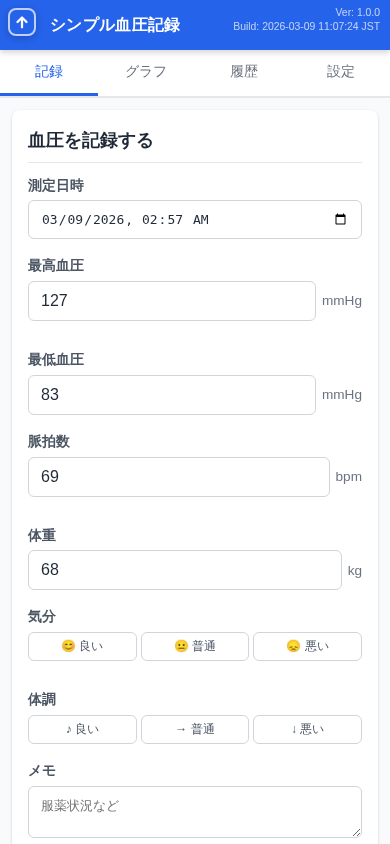
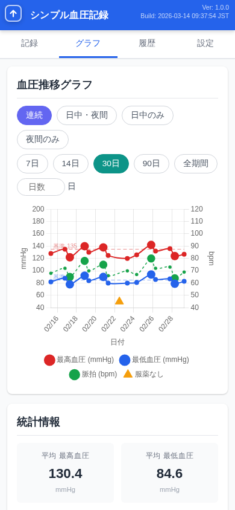
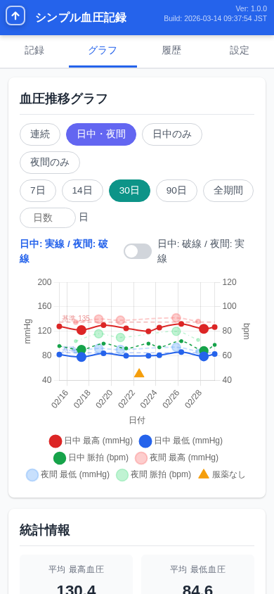
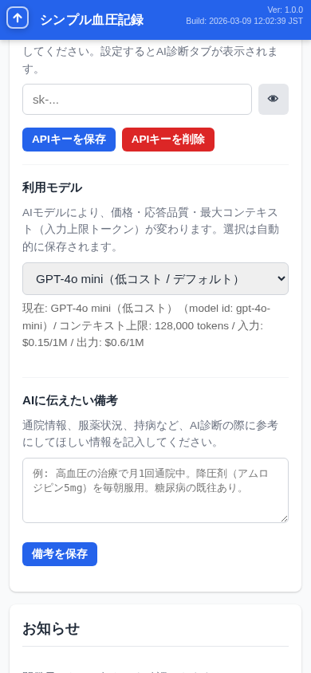
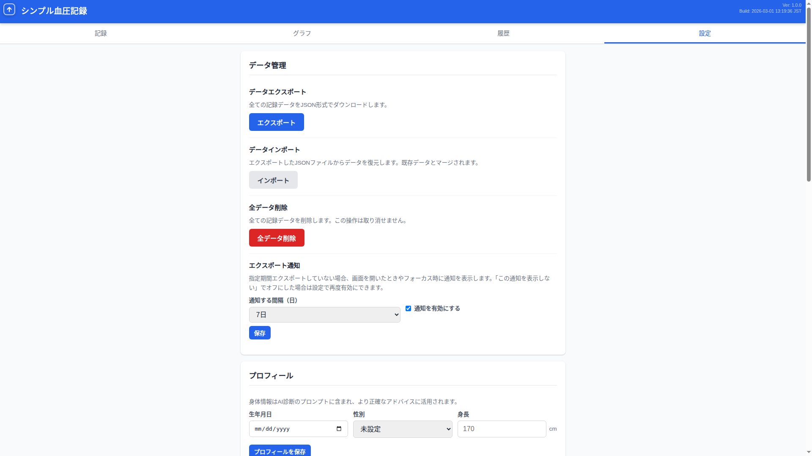

# 血圧管理、まだ手帳に書いてませんか？

**月額0円・登録不要・3分で開始。** ブラウザだけで完結する、毎日の血圧管理アプリ。

---

## こんなお悩み、ありませんか？

> 「手帳に書くのが面倒で、血圧記録が3日で途切れた...」

> 「記録はしてるけど、グラフ化するのが大変で通院時に見せられない...」

> 「月額数百円の血圧アプリ、ただ記録するだけなのに高くない？」

高血圧で通院している方にとって、毎日の血圧記録は**欠かせない**もの。
でも、手帳への記入は面倒で続かない。アプリを使おうにも月額課金やアカウント登録が必要。

**シンプル血圧記録は、そんなあなたのために作りました。**

---

## シンプル血圧記録とは

ブラウザを開くだけで使える、**完全無料**の血圧管理アプリケーションです。

<table>
<tr>
<td align="center" width="33%">
<h3>ずっと無料</h3>
月額0円。隠れた課金もありません。 家計を圧迫しません。
</td>
<td align="center" width="33%">
<h3>かんたん操作</h3>
アカウント登録不要。 ブラウザを開いて3分で最初の記録が完了。
</td>
<td align="center" width="33%">
<h3>安心・安全</h3>
データはお使いの端末内に保存。 AI診断利用時を除き、外部送信なし。
</td>
</tr>
</table>

---

## 主な機能

### 血圧記録 + 自動分類

最高・最低血圧、脈拍、体重、気分、体調、メモを入力して保存。JSH2019ガイドラインに基づく血圧分類が**自動で表示**されます。前回の値がプリフィルされるので、変わった値だけ修正すればOK。

---

### グラフ4モード — 血圧推移を可視化

連続・日中/夜間・日中のみ・夜間のみの4モードで、血圧の推移を多角的に分析。期間切り替え（7日/30日/90日/全期間）や統計情報も充実。体重を記録していれば、体重推移グラフも自動表示されます。

---

### AI健康アドバイス

OpenAI APIと連携し、蓄積した血圧データをAIが分析。通院前に主治医に聞くべき質問のヒントが得られます。通院情報や服薬状況を備考に登録しておけば、よりパーソナライズされたアドバイスに。

> **注意:** AI診断は医療行為ではありません。参考情報としてご利用ください。体調に不安がある場合は必ず医療機関を受診してください。AI診断を利用する場合、血圧データがOpenAI社のAPIに送信されます。

---

### データ管理 — バックアップも安心

JSON形式でエクスポート・インポートが可能。端末の買い替え時にも、ファイル一つでデータを移行できます。定期的なバックアップリマインダーも搭載。

---

## 選ばれる理由

| 比較項目 | 手帳 | 有料アプリ | シンプル血圧記録 |
|---------|------|-----------|---------------|
| **料金** | ノート代 | 月額200〜500円 | **無料** |
| **導入の手軽さ** | すぐ始められる | アカウント登録が必要 | **ブラウザで即開始** |
| **グラフ化** | 手動で作成 | 対応 | **4モード自動表示** |
| **血圧分類** | 自分で判定 | 対応 | **JSH2019自動判定** |
| **AI分析** | 不可 | 一部対応 | **OpenAI連携** |
| **データの安全性** | 紛失リスク | サーバーに依存 | **端末内で完結** |
| **オフライン利用** | 対応 | 不可の場合あり | **対応** |

---

## こんな方におすすめ

**健康診断で高血圧を指摘された方**
「記録してください」と言われたけど、何を使えばいいかわからない。シンプル血圧記録なら、ブラウザを開くだけですぐに始められます。

**降圧薬を服用中の方**
毎日の血圧変動を記録して、薬の効果を可視化。服薬忘れの記録も残せるので、通院時の報告がスムーズに。

**ご家族の血圧を管理している方**
シンプルな操作なので、スマホに不慣れなご家族でも使いやすい設計です。

**通院時にデータを見せたい方**
グラフと統計をスマホでそのまま医師に見せられます。日付フィルタで通院間の記録だけ表示することも可能。

---

## セキュリティとプライバシー

シンプル血圧記録はあなたのデータを**基本的に外部に送信しません**。

- すべてのデータは、お使いのブラウザ内（IndexedDB）に保存されます
- サーバーとの通信は、アプリ本体の読み込み時のみ
- インターネット接続がなくても動作します（PWA対応）
- JSON形式でのエクスポートに対応。バックアップや端末移行も安心です

> **AI診断機能について:** AI診断を利用する場合、血圧データがOpenAI社のAPIに送信されます。AI診断はオプション機能であり、APIキーを設定しない限りデータの外部送信は一切行われません。

「健康データをクラウドに預けるのは不安...」という方にこそ、おすすめです。

---

## はじめかた — たった3ステップ

### Step 1: アクセスする

ブラウザでシンプル血圧記録を開くだけ。インストールもアカウント登録も不要です。

### Step 2: 血圧を測って記録する

血圧計で測定したら、数値を入力して「記録を保存」をタップ。30秒で完了です。

### Step 3: グラフで傾向を確認

記録が溜まったらグラフタブへ。血圧の推移が一目でわかります。

---

## よくある質問

**Q. 本当に無料ですか？**
はい、完全無料です。広告表示もありません。オープンソース（MIT License）で公開されています。

**Q. データはどこに保存されますか？**
お使いのブラウザ内（IndexedDB）に保存されます。AI診断機能を利用しない限り、外部サーバーへの送信は行いません。

**Q. 血圧の分類基準は何ですか？**
日本高血圧学会（JSH2019）のガイドラインに基づいて、正常血圧からIII度高血圧まで6段階で自動分類します。

**Q. オフラインで使えますか？**
はい。PWA（Progressive Web App）対応のため、一度アクセスすればオフラインでも利用できます。ホーム画面に追加すれば、アプリのように起動できます。

**Q. データのバックアップはできますか？**
はい。JSON形式でエクスポート・インポートが可能です。端末の買い替え時にも、ファイル一つでデータを移行できます。

**Q. スマートフォンでも使えますか？**
はい。PC・タブレット・スマートフォンに対応したレスポンシブデザインです。

**Q. AI診断機能を使うには？**
OpenAI APIキーが必要です。設定タブからキーを入力するだけで利用できます。

---

## 活用事例を見る

実際の活用シーンを、画像付きで詳しくご紹介しています。初期セットアップから日々の記録、グラフ分析、AI活用まで — シンプル血圧記録の使い方がひと目でわかります。

[**→ 活用事例を見る**](usecases_showcase.html)

---

## 今すぐ、無料で始めましょう

血圧管理に費やしていた手間を、**健康に集中する時間**に変えませんか？

アカウント登録不要。ブラウザを開くだけで、すぐに使い始められます。

[**→ シンプル血圧記録を試してみる**](index.html)

使い方を詳しく知りたい方は、[**→ ユーザーマニュアル**](manual.html) をご覧ください。

活用事例を見たい方は、[**→ 活用事例**](usecases_showcase.html) をご覧ください。

---

シンプル血圧記録はオープンソースソフトウェアです（MIT License）。
