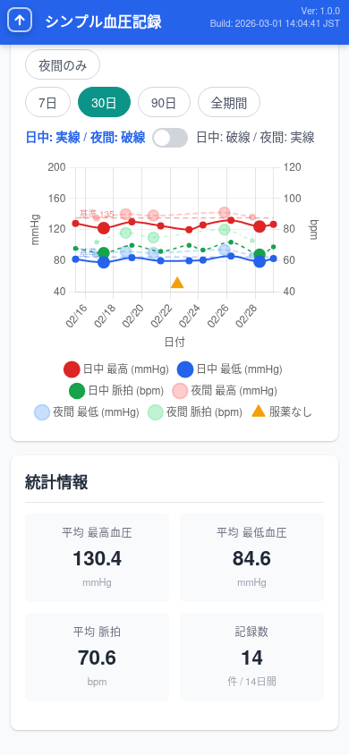
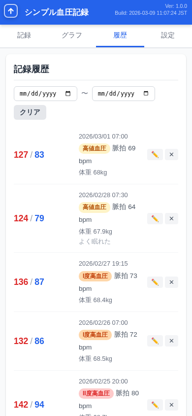
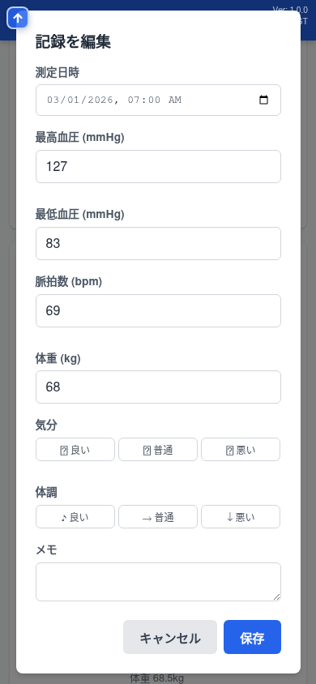
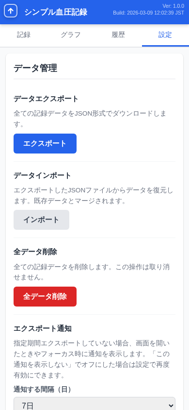
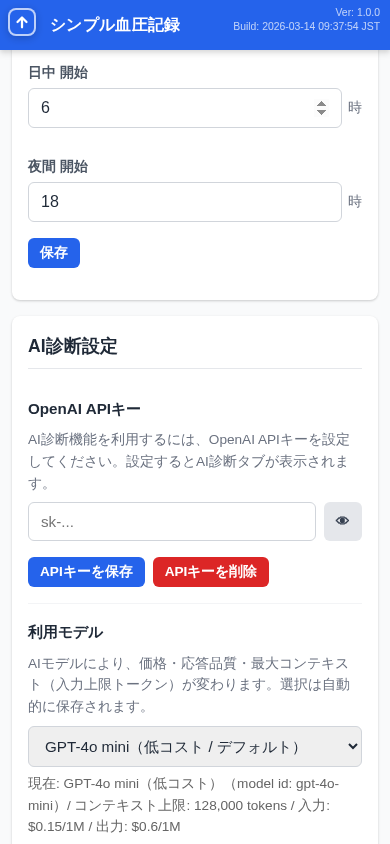
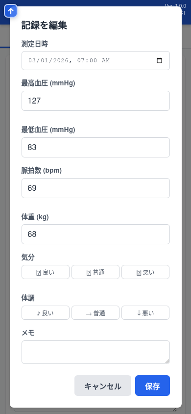

# シンプル血圧記録 活用事例 — 佐藤健一さんの血圧管理

**「毎日の血圧管理が、こんなに簡単だったとは」**

55歳会社員の佐藤健一さんは、健康診断で高血圧を指摘され通院中。降圧薬（アムロジピン5mg）を処方されていますが、手帳への記録が続かず困っていました。同僚に勧められた「シンプル血圧記録」で、毎日の記録が習慣に変わりました — 8つのシーンでご紹介します。

---

## UC1: 初期セットアップ — アプリの導入と最初の記録

ブラウザでアプリを開いたら、すぐに使い始められます。アカウント登録もメールアドレスも不要。ホーム画面に追加すれば、ネイティブアプリのように起動できます。

最初の記録はフォームに数値を入力して「記録を保存」をタップするだけ。保存するとすぐに血圧分類（JSH2019基準）がバッジで表示されます。

**ポイント**
- 入力欄をタップすると値が全選択されるので、そのまま新しい値を入力すれば上書き可能
- 血圧分類は自動判定。正常血圧（緑）からIII度高血圧（濃い赤）まで色分け表示
- PWA対応でホーム画面に追加すれば、オフラインでも使える

---

## UC2: 日々の記録ルーティン — 朝晩の記録と服薬忘れ

毎日の記録は、前回の値がプリフィルされるのでとても楽です。変わった値だけ修正して保存するだけ。降圧薬を飲み忘れた日は、血圧を測らなくても「服薬なし」だけ記録できます。

**ポイント**
- 前回値のプリフィルで入力の手間を大幅削減
- 測定日時は毎回現在時刻が自動セット（前回の日時は引き継がない）
- 服薬なしの記録は履歴やグラフにも反映され、通院時の報告に役立つ

---

## UC3: グラフ分析 — 血圧推移の確認

2週間分のデータが溜まったら、グラフタブで血圧の推移を確認しましょう。連続モードで全体の傾向を見たり、日中・夜間モードで朝と夜の血圧差を比較できます。

体重を記録していれば、統計情報の下に体重推移グラフも表示されます。

**ポイント**
- 4つの表示モード（連続/日中・夜間/日中のみ/夜間のみ）で多角的に分析
- 期間切り替え（7日/14日/30日/90日/全期間）で短期・長期の傾向を把握
- ツールチップでポイントの詳細を確認。メモ付きの記録はメモも表示
- 統計情報（平均値・記録数）が期間に連動して自動計算
- 体重推移グラフで体重の変化も同時に確認
- 服薬なしの日は三角形マーカーで表示

---

## UC4: 履歴管理 — 記録の閲覧・編集・削除

履歴タブでは全ての記録を新しい順に一覧表示。日付フィルタで特定の期間に絞り込み、通院日に先生に見せる記録を素早く見つけられます。

**ポイント**
- 日付フィルタで開始日・終了日を指定して期間を絞り込み
- 鉛筆アイコンで記録を編集、×ボタンで削除
- 服薬なし記録の編集は日付とメモのみ変更可能

---

## UC5: AI健康アドバイス — AI診断の活用

通院前にAI診断を使えば、最近の血圧データを分析して健康アドバイスをもらえます。主治医に聞くべき質問のヒントにも。

> **注意:** AI診断は医療行為ではありません。参考情報としてご利用ください。体調に不安がある場合は必ず医療機関を受診してください。AI診断を利用する場合、血圧データがOpenAI社のAPIに送信されます。

**ポイント**
- OpenAI APIキーを設定するだけで利用可能
- 診断範囲（7日/14日/30日/90日/全期間）を選んで分析
- 通院情報や服薬状況をAI備考に記入しておくと、より的確なアドバイスに
- 提案質問ボタンで会話を深められる

---

## UC6: データバックアップ — エクスポート・復元

スマホの機種変更や万が一のデータ消失に備えて、設定タブからワンタップでバックアップ。JSON形式のファイルとしてダウンロードされます。

**ポイント**
- エクスポートファイルには血圧記録・プロフィール・AI設定・グラフ設定のすべてが含まれる
- インポートで別の端末にデータをそのまま復元可能
- エクスポート通知リマインダーでバックアップ忘れを防止
- データはすべて端末内（ブラウザ）に保存。AI診断利用時を除き、外部送信なし

---

## UC7: プロフィールとカスタマイズ

プロフィール（生年月日・性別・身長）を設定すると、AI診断がより正確なアドバイスを返します。グラフの日中/夜間の時間帯も、自分の生活リズムに合わせて変更できます。

**ポイント**
- プロフィール情報はAI診断のプロンプトに自動的に含まれる
- グラフの日中/夜間区切りをカスタマイズ可能（デフォルト: 6時/18時）
- 早起きの人は5時/17時、遅い人は8時/21時など柔軟に設定

---

## UC8: アプリのメンテナンスと通知

アプリ情報でバージョンを確認し、最新版への更新もワンタップ。お知らせ機能で新機能やメンテナンス情報を確認できます。

**ポイント**
- 「更新を確認」で新バージョンの有無をチェック
- 「強制更新」でService Workerのキャッシュを完全クリア（データは消えない）
- お知らせ通知のON/OFFを設定で切り替え

---

## まとめ — シンプル血圧記録が佐藤さんにもたらした変化

シンプル血圧記録の導入により、佐藤さんの血圧管理は大きく変わりました。

- **記録の習慣化** — プリフィルと簡単操作で、毎日の記録が苦にならない
- **傾向の可視化** — グラフと統計で、降圧薬の効果を実感
- **通院の質が向上** — AI診断と履歴で、主治医との対話がより具体的に
- **データの安心** — エクスポートで大切な記録をしっかりバックアップ

すべてブラウザだけで完結。月額料金もアカウント登録も不要。データは端末内に安全に保存されます（AI診断機能を利用する場合を除く）。

---

## 今すぐ試してみましょう

[**シンプル血圧記録を使う →**](index.html)

使い方を詳しく知りたい方は [**ユーザーマニュアル →**](manual.html) をご覧ください。

アプリの機能概要・比較は [**紹介ページ →**](promotion.html) をご覧ください。

---

シンプル血圧記録はオープンソースソフトウェアです（MIT License）。
